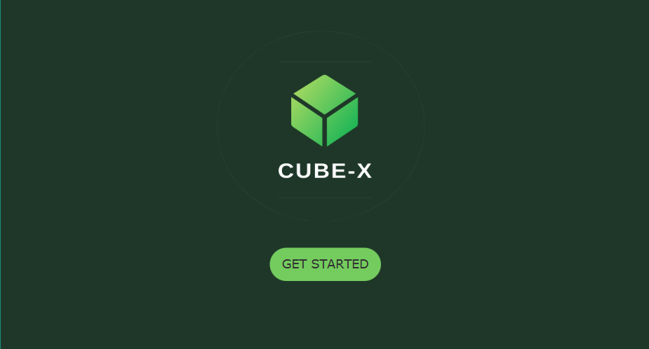
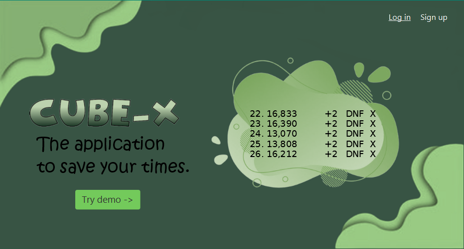
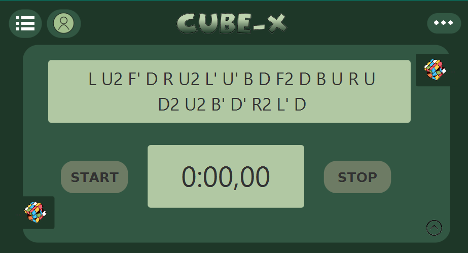
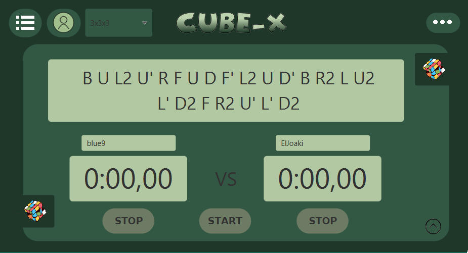
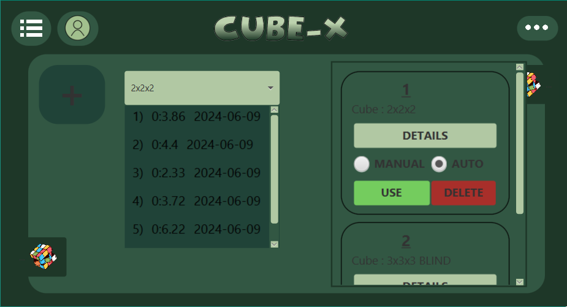
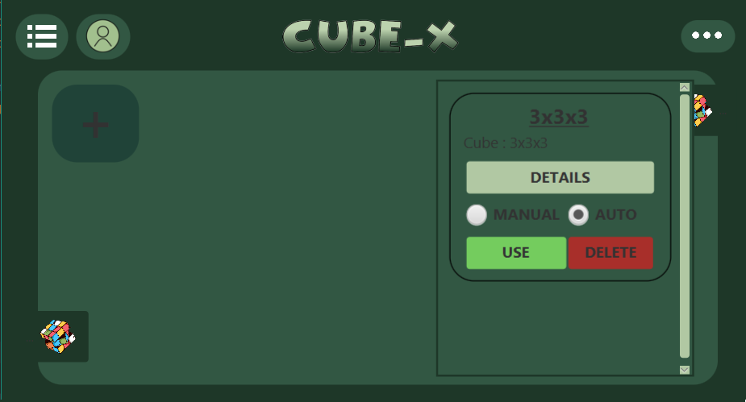
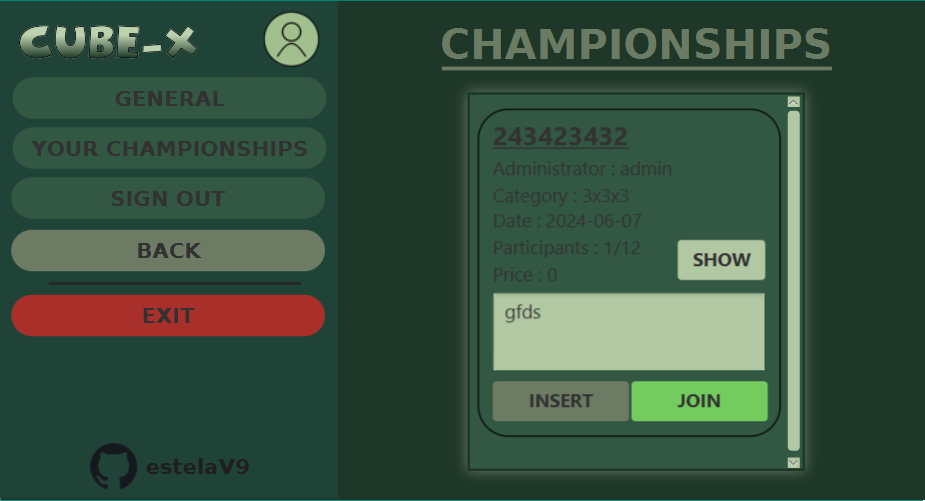
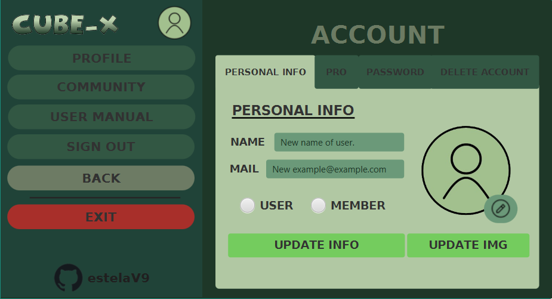

# CubeX
Proyecto final de programación : CubeX App 

## Descripción 
**_CUBE_X_** es una aplicación diseñada para los entusiastas de cubos de Rubik, que permite guardar sus tiempos de resolución, con sus estadísticas, organizar competiciones uno versus uno y participar en campeonatos. 

## Características
- **Cronómetro**: Registra con los tiempos de resolución para varios tipos de cubos de Rubik.
- **Competiciones Uno Versus Uno**: Haz enfrentamientos con otra persona.
- **Campeonatos**: Compite en campeonatos y monitorea tu progreso.
- **Estadísticas**: Analiza tu rendimiento con estadísticas detalladas, incluyendo promedio de cinco (Ao5), mejores tiempos personales (PB) y otros indicadores clave.
- **Clasificaciones**: Consulta las tablas de clasificación de los mejores promedios de la comunidad y sube en el ranking.

## Terminología
- **Algoritmo**: Una secuencia de movimientos diseñada para lograr un objetivo específico, como resolver una cara o permutar piezas.
- **Notación**: Utiliza letras para denotar movimientos, siendo la más común la notación Singmaster.
- **PB (Personal Record)**: El mejor tiempo que ha logrado un cubero con un tipo específico de cubo.
- **DNF (Did Not Finish)**: Penalización por exceder el tiempo de inspección o no resolver el cubo correctamente.
- **Ao5, Ao12**: Promedio de cinco o doce resoluciones, calculado excluyendo los mejores y peores tiempos y promediando el resto.

## Secciones de la Aplicación

Intro                               | Registro de Usuario                                       			                    
:------------------------------------------:|:-------------------------------------------:|
 La aplicación se abre con el logo de **_CUBE_X_** y   un botón "GET STARTED" que llevará a la página para registrarse. |  Elige cómo quieres registrarte : usuario regular o explorar como usuario demo. 
  |   

 Cronómetro                           | Competiciones                           | Sesiones                             |
:-----------------------------------------:|:-----------------------------------------:|:--------------------------------------------:|
Incluye un generador de scramble, un cronómetro y botones para iniciar y detener los cronómetros. Los usuarios pueden ver su historial de los tiempos de la sesión activada a través de un menú desplegable. |  Incluye un generador de scramble, dos cronómetros y botones para iniciar y detener los cronómetros. Los usuarios pueden ver su historial de competiciones a través de un menú desplegable. | Permite a los usuarios crear y gestionar sus sesiones de resolución, con limitaciones basadas en el tipo de usuario (normal, miembro o demo). |
| | |
 
 Campeonato                       | Configuración
:-----------------------------------------------:|:-------------------------------------:|
Participa en campeonatos, con opciones para unirse, abandonar, insertar tiempos o ver detalles sobre los campeonatos. | Personaliza el perfil del usuario, visualiza los mejores promedios y el manual de usuario, incluyendo opciones para cerrar sesión o salir de la aplicación. |   
| |

 

<table>
  <tr>
    <th>Horas Totales</th>
    <th>Nota Final</th>
  </tr>
  <tr>
    <td>140</td>
    <td>9.5</td>
  </tr>
</table>

---

  <h2>¡Disfruta de la app!</h2>

>_IES Ribera de Castilla._
